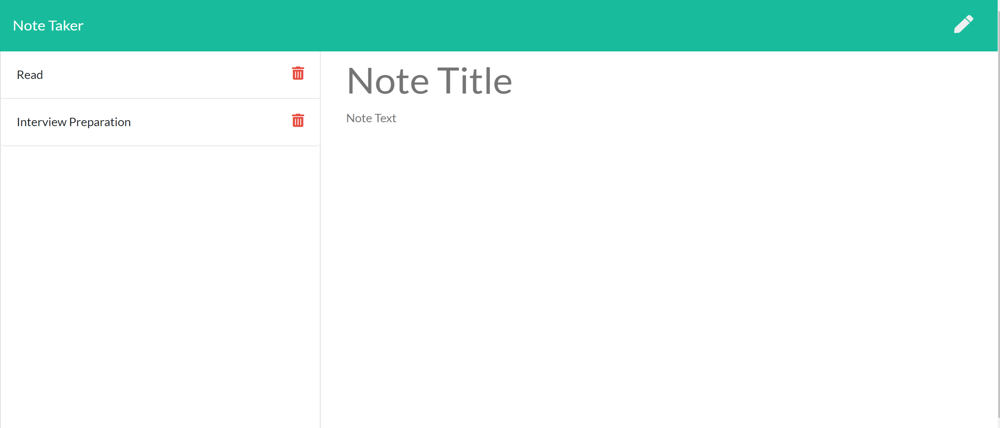

# Note-Taker

## The Repository

The link to the website repository: [Website Repo link](https://github.com/NavdeepDP/Note-Taker)

The link to deployed website [Website Link](https://notes-taker-project.herokuapp.com/)

## Development Environment
- Code is developed in VS code Studio

## Website Functionality

Note taker allows user to create , save and delete old notes. User can also select the note to view the details.

## Installation

- Code is developed using VS Code studio.
- Code is available at the GITHub repository link: [Website Repo link](https://github.com/NavdeepDP/Note-Taker))
- Get the code code in your local machine by using the clone option in the repository link.
- Click "Code" and copy the Clone with SSH key link.
- In Git bash, go to the appropriate directory and get the code using "git clone" command.
- In Vs Code terminal , go to the project directory.
- Run "npm install" - it will install all the packages(inquirer for this application) required for the application.  

## References

- [w3schools.com](https://www.w3schools.com/)
- [MDN web docs](https://developer.mozilla.org/en-US/docs/Web/JavaScript)
- [Inquirer](https://www.npmjs.com/package/inquirer#methods)
- [Nodejs Links](https://nodejs.org/dist/latest-v12.x/docs/api/index.html)
- [Express](https://expressjs.com/en/5x/api.html)